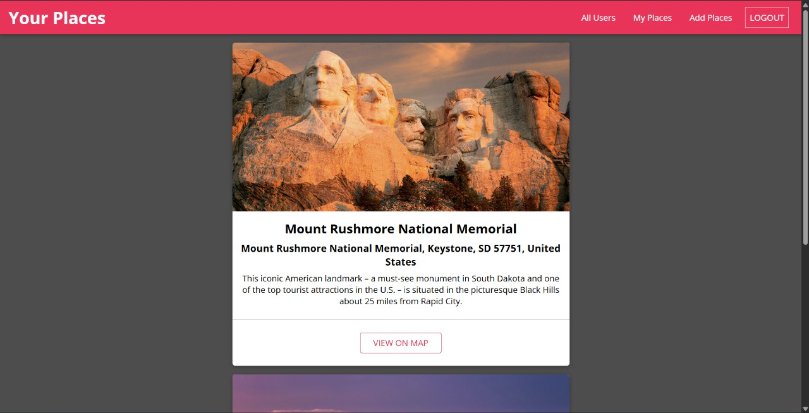
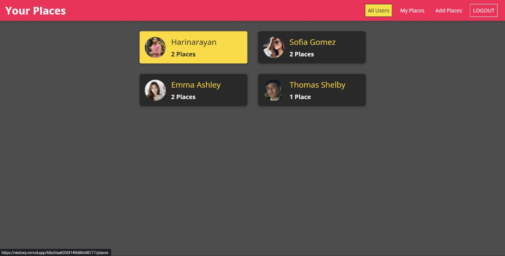

# 🌍 Places App (Frontend)

<!-- First Row -->

    
    

Welcome to the **Places App project repository!**  
This project is designed to provide a smooth and interactive experience for managing users and places, built using **React** for the frontend. It allows users to sign up, log in, view other users, and add or explore places with location details. Each place contains a **title, description, image, and address**, with the address automatically converted into geographical coordinates using the **Google Maps API**.

## Technologies Used and Relevant Skills

### Frontend
- **React**: Developed the frontend using React to build reusable components, manage state efficiently with hooks, and implement routing with React Router.  
- **CSS**: Designed and styled the user interface with responsiveness in mind for a seamless user experience.  

### API Integration
- **Google Maps API**: Integrated the Geocoding API to automatically convert addresses into latitude and longitude coordinates.

## Getting Started

When you first open the website, you will be greeted with a **All Users Screen**.  
- New users can **sign up** to create an account.
- Existing users can **log in** to add places.  

Authentication ensures that only logged-in users can add, delete, or manage their own places.  

## Features

### 🔐 Authentication
- Secure **signup** and **login** functionality  
- Authentication state maintained across the app  

### 👤 User Profiles
- View all registered users  
- Explore places uploaded by specific users  

### 📍 Places Management
- Add new places with:  
  - Title  
  - Description  
  - Image  
  - Address (auto-fetched coordinates via Google Maps API)  
- View your own uploaded places  
- Browse places uploaded by others  
- Delete your own places  

### 🗺️ Google Maps Integration
- Converts **address → coordinates** automatically  
- Provides accurate location data for each place  

---

## Thank You!

Thank you for exploring this **Places App project**.  
It’s a great example of combining **React frontend development** with **API integration** to create a user-friendly application.

---
